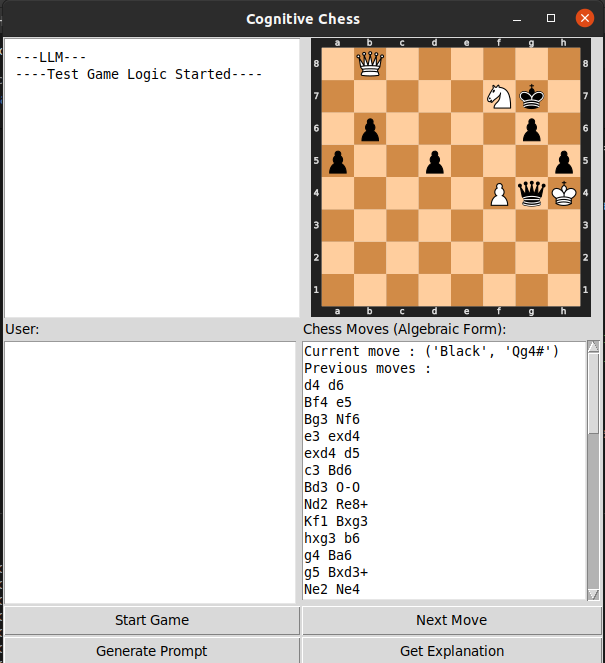

# Chess GUI with Tkinter

This is a simple Python application that generates a chess GUI using Tkinter, Chess and Chess.svg. It includes a chess board rendered from SVG using the python-chess library and displays it within a Tkinter window. Additionally, it provides a text input box for user interaction.


## Features

- Renders a chess board using python-chess library.
- Displays the chess board within a Tkinter window.
- Allows user interaction via a text input box.

## Installation

1. Clone this repository:

```bash
git clone https://github.com/your_username/chess_gui.git
cd chess_gui
```
2. The ChessBoard in render_board.py will render the chess board and it expects a MyChess object with a list of moves.
```%python
    moves = "d4 Nf6 c4 c5 e3 cxd4 exd4 d5 Nf3"
    app = ChessBoard(MyChess(moves))
    app.mainloop()
```
## To do -
- Top left box for API integration (leave)
- Fix "current and prevous moves" widget, currently it's working since i have only 4 previous moves, try around 10 to 15 and see if it changes. If it doesn't work, cover part of the chess board; please fix it. You may need to look at "wraplength"
- On cell 0,0 we want to show LLM output, so make a dummy input and LLM output for chess engine and the finetuned model. Display the output in <user> and <assistant> layout.
- The user input box does not have anything yet. Store user input in a variable and print it on the 0,0 cell.
- Create a button wherever you like called "next_move", we may use it but not sure yet. Just create the button for now. 